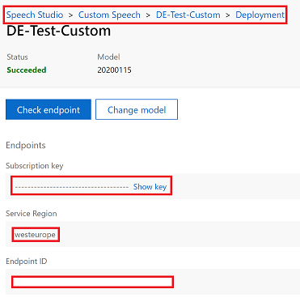

# Speech Toolkit
The speech toolkit is a lightweight, Python-based collection of scripts to support you with text and speech use cases, especially at the following tasks:
- Batch-transcribe audio files to text transcripts using [Microsoft Speech to Text](https://azure.microsoft.com/en-us/services/cognitive-services/speech-to-text/)
- Batch-synthesize text data using [Microsoft Text to Speech Service](https://azure.microsoft.com/en-us/services/cognitive-services/text-to-speech/)
- Batch-score text strings on a [Microsoft LUIS](https://luis.ai)-model
- [to extract LUIS files from Excel sheets and with that create test data sets to be scored using a LUIS endpoint.]

## Know before you go
This toolkit is based on multiple, free and/or open source software components. This section helps you to check whether you are all set for using it. 

### Prerequisites
Before getting your hands on the toolkits, make sure your local computer is equipped with the following frameworks and base packages:
- [Python](https://www.python.org/downloads/windows/) (required, Version 3.8 is recommended)
- [Anaconda](https://www.anaconda.com/distribution/) (required) __or__ [Miniconda](https://docs.conda.io/en/latest/miniconda.html) (recommended)
- [VSCode](https://code.visualstudio.com/docs/?dv=win) (recommended)
  - alternatively, you can also run the scripts using PowerShell or PyCharm
- [git](https://git-scm.com/downloads) (recommended, alternatively download the repository as zip)
- Internet access for installing your environment and scoring the files

After making sure these are all available on your system, the environment can be set up.

### Setup of Conda-environment
1. Open your PowerShell or open VSCode
2. Change the directory to your preferred workspace (using `cd`)
3. Download the repository as a ZIP-archive and unpack your file locally to the respective folder
4. Enter the root folder of your repository
5. Set up the Conda environment using the yaml file<br> `conda env create -f environment.yml`
6. After successfully installing the yaml-file, your environment is set up and you can go ahead. See the following section how to activate it.
7. In any case, you should activate your `txttool` conda environment to make sure all the required packages are loaded. Submit this command in your preferred workspace:<br>`conda activate txttool`<br>
Afterwards, you should be able to see the activated environment in the command line:<br>`(txttool)`
8. (Optional) For installing the kernel to Jupyter Hub in order to use the notebooks, do the following steps:<br>
`conda install ipykernel --name txttool`<br>
`python -m ipykernel install --user --name stk --display-name "Python (txttool)"`

### Get your keys
In the root directory, you will find a file named `config.sample.ini`. This is the file where all the LUIS keys have to be set. First, create a copy of this file and rename it to `config.ini`. You only need the keys for the services you use during your experiment. However, keep the structure of the `config.ini`-file as it is to avoid errors. The toolkit will just set the variable values as _none_, but will throw an error when the keys cannot be found.

#### Text to Speech
- Go to the [Azure portal](https://portal.azure.com), open the Cognitive Service resource you want to use
- Be aware that not every voice is available in every Azure region

```
[synth]
key=
region=
resource_name=
language=
font=
```

#### Speech Service
- Go to the [Microsoft Speech Service portal](https://speech.microsoft.com), open your respective case and follow the breadcrumbs as illustrated below
- Copy the values from the highlighted fields
- In case you are not using a custom endpoint, it is sufficient to copy the subscription key as well as the region from your Azure Cogntitive Service resource in the [Azure portal](https://portal.azure.com)



The final file should look as below:
```
[speech]
key=
endpoint=
region=
```

#### LUIS
 Open the file and set the respective keys for the `[luis]`-section. You can ignore the other parts. For this purpose, go to your LUIS app by accessing the [portal](https://luis.ai). Click on your app and click _MANAGE_/_VERWALTEN_. In the _Settings_-section, copy the _App ID_ and insert it in the file. Afterwards, go to _Azure Resources_ below, make sure you are in the tab _Prediction Resources_/_Vorhersageressourcen_ and copy+paste the following keys and names:


For `slot`, either insert `staging` or `production`, depending which deployment slot you are using with your LUIS model. Region can remain blank.

The final section should look as below:
```
[luis]
key=12312a873891f2738b912798
app_id=1a23456-b321-4a4a-9c08-09bdaf5b520e
endpoint=nameofyourservice
region=
slot=staging
```

You are now ready to score your test set with LUIS.

## How to use

### File guidelines
There are some rules how the input files have to look like:
- tab-delimited file (If you only have an Excel sheet, you can create it using Excel -> Save as -> .txt (tab-delimited))
- UTF-8 encoding (to make sure it has the correct encoding, open it with a text editor such as [Notepad++](https://notepad-plus-plus.org/downloads/) -> Encoding -> Convert to UTF-8)
- Column names with the respective values dependent on the mode
- of columns _intent_ (ground-truth LUIS-intent) and _text_ (utterance of the text, max length of 500 characters)
- We recommend you to put the input file in the subfolder `input`.

|                 | __"intent"-column__ | __"text"-column__ | __"Audio File"-folder__ |
|-----------------|---------------------|-------------------|-------------------------|
| --do_synthesize |                     | X                 |                         |
| --do_transcribe |                     |                   | x                       |
| --do_evaluate   |                     | X                 |                         |
| --do_scoring    | X                   |                   |                         |
| --audio_files   |                     |                   | X                       |

You can find an example file [here](input/testset-example.txt).

### Text to Speech


### Get a Train-Test-Split
There are two approaches how to do this. You can either bring a pre-defined data set and use it as test data. If you have a big data set and want to have a split of it, first use `helper.py` to get a stratified split. Stratifiyng the data set means, that you will get a sample of 25% of the data, which is not randomly sampled. The sampling mode helps you to make sure that sufficient examples of every class are present in the test data set.

The file will then be written to the input folder of the repository with the following notation:<br>`[yyyy-mm-dd-]-stratify-test.txt`

Use this as input parameter for the `speechTools.py`.later on.

__INFO:__ if you do not need to get a sample from the data and just take the whole one as test set, just skip this and continue with the step below!

### Scoring of LUIS Test Data Set
This section helps you to start your LUIS scoring with help of `speechTools.py`. With the command line or IDE of your choice, navigate to the root directory of the Data Science repository. Among others, you can pass the following parameters (the others are not covered by this documentation as they are not needed):

```
--input INPUT           give the whole path to tab-delimited file
--mode MODE             mode, either score or eval
--subfolder SUBFOLDER   input folders, pass comma-separated if multiple ones
--treshold TRESHOLD     Set minimum confidence score between 0.00 and 1.00
--do_scoring            Text to speech using Microsoft Speech API
```

1. Make sure your conda environment is activated, otherwise do by <br>`conda activate txttools`
1. Put your tab-delimited scoring file into the `input` folder of the repository and make sure that it has the columns `intent` and `text`. Otherwise, the script will not find the correct values.
1. Execute the following command:<br>
`python code/speechTools.py --input input/scoringfile.txt --do_scoring`<br>
The default treshold value for the LUIS scores is `0.82`, but you can choose a custom one by additionally passing `--treshold 0.91`, e.g.:<br>
`python code/speechTools.py --input input/scoringfile.txt --do_scoring --treshold 0.91`<br>If you want to avoid the drop, just pass `--treshold 0`.
1. The scoring may take a while and you will receive some log information in your command line. For every utterance, you will see logs which prediction the LUIS model returned. If you only get back the message `prediction` in every row, there is something wrong with the keys and you should cancel the scoring with `ctrl + c`
1. When the scoring is finished, you will get a classification report and a confusion matrix, which provides you an overview on the model performance based on the given test data set. There will be two of them: one with the drop defined by the `--treshold` and the other one without considering the drops.
1. After finishing, you will find the output files in the `output` directory (which you find in the parent folder above the repository). In this folder, there is an `input` folder, containing the input file of the scoring round. In the case folder itself, you will find a `[date]-case.txt` file with the respective scorings, e.g. `2020-07-23-case`.

#### Output format
The script generates a case folder for every run and will have the structure below. Every file you used will be registered here as well and copies to the input folder to allow traceability.
```
- case: [yyyy-mm-dd]-case/
 | -- input/
    | -- [input file]
 | -- [yyyy-mm-dd]-[lang]-case.txt
 | -- transcriptions.txt (can be ignored in this context)
```

The following table shows the structure of the scoring file and gives you an example how predictions are handled, also when the confidence score is low.
| intent | text | prediction | score | drop |
| --- | --- | --- | --- | --- |
| Intent name based on reference Excel file | Raw text string | Predicted intent by LUIS app | Certainty score of LUIS model, between 0 and 1 | Predicted intent by LUIS app, _None_-intent in case of dropped value (when below the confidence score e.g. of 0.82) |
| Book_Flight | I would like to book a flight to Frankfurt. |	Book_Flight |	0.9450068 | Book_Flight |
| Flight_Change | Please rebook my flight to Singapore, please | Change_Flight | 0.9112311 | Flight_Change |
| Flight_Change |	I would like to change my flight. |	Flight_Cancel |	0.5517158 |	None |

### Evaluation with the Jupyter Notebook
To get deeper insights into the classification performance, there is a Jupyter notebook in the `notebook` subdirectory. 
1. Open the `Eval - LUIS Scoring Review.ipynb` Jupyter notebook in the `notebook` subfolder of the repository
1. Choose the right kernel `Python (txttool)`, which you installed
1. Place the scoring file from the output folder in the same folder as the notebook or just keep the directory in mind. There is an example file in the notebooks-folder as well
1. Change the file name in the `Import data` section. If you want to reference to the file in the output folder, change it to `../../output/[date-of-case]-case/[date-of-case]-case.txt`.
1. Execute all the fields - this might take a while especially during the plotting phase of the confusion matrix
1. If you want to store the evaluation report, you can do this by "File -> Export -> .html" and open it with any modern internet browser